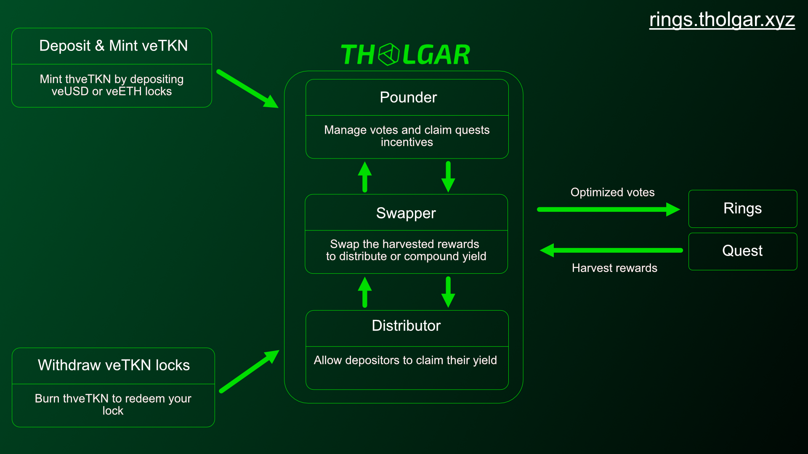

# Overview

## What is Rings ?

Rings is a meta-assets for USD, ETH & BTC offering competitive yield for stakers, providing deep liquidity for Sonic DeFi, and funding Sonic DeFi projects via its lockers. You can read more about it [here](https://https://docs.rings.money/).

## What is the Rings auto voter ?

It is a product built by Tholgar team. This enable users to earn the most from their veNFTs by voting to the most rewarding quests.  
  
All rewards are swapped into either scUSD for veUSD or scETH for veETH and distributed on a weekly basis, they can be claimed inside the interface.  
  
It emits an ERC721 receipt token to enable more composability with other protocols.  

## Addresses

### veUSD
- RewardsDistributor: [0x485EaBED09819428E7aC87139102CD9D83a784bD](https://sonicscan.org/address/0x485EaBED09819428E7aC87139102CD9D83a784bD)
- Puppeteer: [0x82136B5B2FA53AEFaB8d7C87467D8e7036Bb3f72](https://sonicscan.org/address/0x82136B5B2FA53AEFaB8d7C87467D8e7036Bb3f72)
- Adapter: [0x605257994ffeF290c9eD8F51e0bF68b2735c17A9](https://sonicscan.org/address/0x605257994ffeF290c9eD8F51e0bF68b2735c17A9)

### veETH
- RewardsDistributor: [0xEe1e11a8c9d6F69E40401050d4bA96eC5b145177](https://sonicscan.org/address/0xEe1e11a8c9d6F69E40401050d4bA96eC5b145177)
- Puppeteer: [0x113166Ad6E99c5346aDF41d5821A6856e1510812](https://sonicscan.org/address/0x113166Ad6E99c5346aDF41d5821A6856e1510812)
- Adapter: [0x60F126D6EaC8971Ed0a755E9A72d1b9532Bb5b99](https://sonicscan.org/address/0x60F126D6EaC8971Ed0a755E9A72d1b9532Bb5b99)
